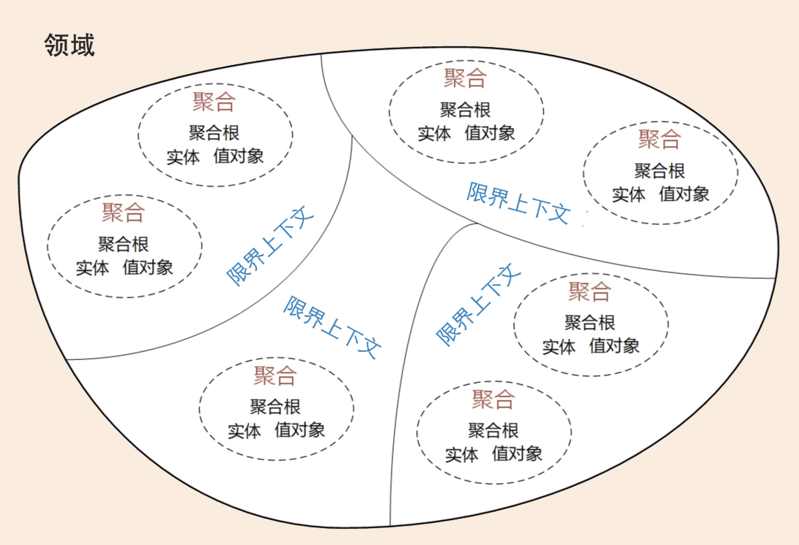
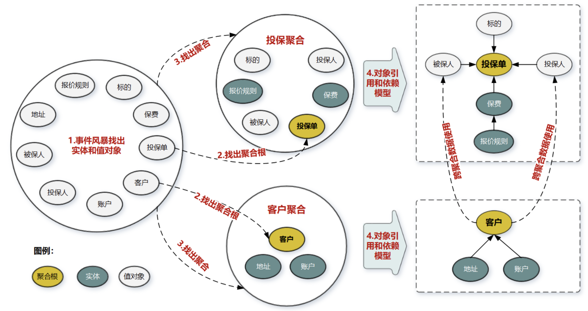

<!-- @import "[TOC]" {cmd="toc" depthFrom=1 depthTo=3 orderedList=false} -->

<!-- code_chunk_output -->

- [什么是DDD](#什么是ddd)
  - [DDD的特点](#ddd的特点)
  - [战略设计、战术设计](#战略设计-战术设计)
  - [DDD在微服务中解决的问题](#ddd在微服务中解决的问题)
  - [DDD的好处与局限](#ddd的好处与局限)
- [领域](#领域)
  - [领域、子域](#领域-子域)
  - [核心域、通用域、支撑域](#核心域-通用域-支撑域)
- [通用语言、限界上下文](#通用语言-限界上下文)
  - [通用语言](#通用语言)
  - [限界上下文](#限界上下文)
- [实体、值对象](#实体-值对象)
  - [实体](#实体)
  - [值对象](#值对象)
- [聚合和聚合根](#聚合和聚合根)
  - [聚合](#聚合)
  - [聚合根](#聚合根)
  - [如何设计聚合](#如何设计聚合)
  - [聚合的设计原则](#聚合的设计原则)

<!-- /code_chunk_output -->

## 什么是DDD
看了一些DDD的介绍、教程，这些教程无一例外都会讲一个关于美好邂逅的故事，故事的情节大概是这样的：DDD是2004年出现的，但一直不温不火，直到十来年后出现了微服务，大家在落地微服务的时候遇到了各种各样的问题，其中就有一个很让人头疼的：“微服务到底要多微”？，大家总说纷纭，直到有人把DDD的方法论应用到微服务的拆分，两者一拍即合，过上了幸福的生活...
我对微服务和DDD都没有太多的了解与实践，不敢妄加评论，但上面的故事情节总感觉有种童话故事中王子遇青蛙、或者武侠小说中少年偶遇隐者学成神功的故事一般，带着巧合、虚幻的味道。也许看似巧合的背后，有更深层次的原因。也许看似美好的结合背后，也不过是解决一个问题、又带来一堆新问题的尴尬。
真实情况到底是什么样，个人目前无法做出判断，且待学完DDD再说。
### DDD的特点
《DDD实战课》的作者欧创新认为：
> DDD 核心思想是通过领域驱动设计方法定义领域模型，从而确定业务和应用边界，保证业务模型与代码模型的一致性。

即主要在于两点：确定业务边界、保证模型与代码一致。但按照之前徐昊在《如何落地业务建模》中的观点，应该再加上“统一语言”一项，它也是DDD的核心，统一语言作为业务人员和技术人员统一的交流语言，而且与模型关联，是DDD能够成功运转的关键。
以下是《如何落地业务建模》的内容摘录：
>Eric 倡导的领域驱动设计是一种模型驱动的设计方法：通过领域模型（Domain Model）捕捉领域知识，使用领域模型构造更易维护的软件。

>模型在领域驱动设计中，其实主要有三个用途：
1.通过模型反映软件实现（Implementation）的结构；
2.以模型为基础形成团队的统一语言（Ubiquitous Language）；
3.把模型作为精粹的知识，以用于传递。

>在 DDD 中，Eric Evans 提倡了一种叫做知识消化（Knowledge Crunching）的方法帮助我们去提炼领域模型：
1.关联模型与软件实现；
2.基于模型提取统一语言；
3.开发富含知识的模型；
4.精炼模型；
5.头脑风暴与试验。

### 战略设计、战术设计
整体来看，DDD分为战略设计、战术设计两大部分。
战略设计从业务视角出发，建立领域模型、划分领域边界、建立通用语言的限界上下文；
战术设计则关注将模型转化为软件实现的过程，涉及聚合根、实体、值对象、领域服务、应用服务等概念。
所以战略设计重在把控方向、建立模型，战术设计重在软件实现。现实中，有人只是将DDD战术设计中用到的工具集、思想拿来使用，比如四层架构、CQRS等，对于这种做法，官方的说法是DDD-Lite，但缺乏战略设计的DDD是没有灵魂的。

#### 如何进行战略设计
战略设计的主要目标是建立领域模型，这个过程一般采用事件风暴（Event Storming）的方式。
事件风暴分两个阶段：发散、收敛。
- 发散阶段：将业务方、技术方召集到一起，然后采用用例分析、场景分析等手段，尽可能全面地分解业务领域，梳理领域之间的关系，这一阶段会产生很多实体、事件、命令等领域对象；
- 收敛阶段：将发散阶段产生的实体、事件、命令等对象，按照不同的维度进行聚合，产生限界上下文、聚合等边界，这一过程通常由DDD专家来完成。

收敛过程是建模的关键，而且往往变化最大，不同人可能产生不同的结果。

### DDD在微服务中解决的问题
前面提到DDD可以用来帮助回答“微服务到底要多微”的问题，那么它是怎么做到的呢？下图为战略设计形成的限界上下文、聚合的示例：

这张图中存在两种边界：聚合边界、限界上下文边界；
限界上下文就可以作为微服务的边界，一个微服务中可以包含一个或多个聚合。

### DDD的好处与局限
>总体来说，DDD 可以给你带来以下收获：
DDD 是一套完整而系统的设计方法，它能带给你从战略设计到战术设计的标准设计过程，使得你的设计思路能够更加清晰，设计过程更加规范。
DDD 善于处理与领域相关的拥有高复杂度业务的产品开发，通过它可以建立一个核心而稳定的领域模型，有利于领域知识的传递与传承。
DDD 强调团队与领域专家的合作，能够帮助你的团队建立一个沟通良好的氛围，构建一致的架构体系。
DDD 的设计思想、原则与模式有助于提高你的架构设计能力。
无论是在新项目中设计微服务，还是将系统从单体架构演进到微服务，都可以遵循 DDD 的架构原则。
DDD 不仅适用于微服务，也适用于传统的单体应用。

既然提了这么多好处，凡事都有里面，那么DDD的局限和弊端是什么呢？
首先，DDD应该更适用于业务系统，所谓业务系统即与公司运营、成本相关的系统，比如电商系统之于京东、阿里、打车系统之于滴滴；而类似人工智能、地图、搜索等系统，则有其特有的设计方法，DDD就不太适用了。
其次，对于业务系统，DDD应该也不是银弹，DDD应该更适用于业务逻辑非常复杂的系统。
而且，DDD自身也存在不少缺陷，比如建模过程依赖于专家经验，不具有唯一性，实施成本高，对开发人员要求高等等。

## 领域
### 领域、子域
广义来讲，领域(Domain)指的是一种特定的范围或区域。领域的作用的划定边界，DDD中所提的领域就是在某个边界内要解决的问题域。
《DDD实战课》用自然科学类比DDD：
> DDD 的研究方法与自然科学的研究方法类似。当人们在自然科学研究中遇到复杂问题时，通常的做法就是将问题一步一步地细分，再针对细分出来的问题域，逐个深入研究，探索和建立所有子域的知识体系。当所有问题子域完成研究时，我们就建立了全部领域的完整知识体系了。

作者举了一个桃树的例子，桃树作为研究对象，是一个大的领域，然后对研究对象按照器官、组织、细胞的层级，将问题一步步细分。

那么借用这个类比，桃树就是最大的问题域（领域），这个领域进一步分成了许多小的领域，称为子域。领域、子域是将大而复杂的问题，进行细分时的产物。

不过类比是把双刃剑，既然将DDD类比为自然科学的也就方法，那么是不是也具有自然科学研究方法中“不靠谱”一面呢，自然科学的研究过程大致遵循“提出假设-验证假设”、“演绎-归纳”的过程，比如观察到的乌鸦都是黑色的，于是提出“所有的乌鸦都是黑色的”，然后进一步观察，后面看到的乌鸦也都是黑色的，就可以认为假设成立。但“所有的乌鸦都是黑色的”这个理论是建立在前面观察的基础上，万一哪天真的发现一直白色的乌鸦，那么这个理论，以及所有以这个理论为基础建立的理论都不成立了。
DDD是否也存在这样的危险呢？

### 核心域、通用域、支撑域
根据自身的重要性、功能属性，可以将子域分类为：核心域、通用域、支撑域
- 核心域：与公司核心竞争力相关的领域；
- 通用域：没有太多个性化诉求，同时被多个子域使用的领域，比如认证、权限等；
- 支撑域：具备企业特性，但没有通用性，也不属于核心的领域，比如数据代码类的数据字典等。

上面桃树的例子中，核心域该如何确定，这要视场景而定，如果桃树生长在公园中，园丁主要关注“人面桃花相映红”的阳春三月，那么花就是核心域；而如果桃树生长在果园，果农更关心桃子是否有好的收成，果实成了核心域。

区分核心域、通用域、支撑域的目的，也在于帮助确定哪些是公司的核心竞争力，以便于将有限的资源和预算投入最核心的领域。
一家公司至少要保证对核心域有绝对的掌控和自主研发能力，对于通用域、支撑域在资源不足时甚至可以考虑采购、外包。

## 通用语言、限界上下文
通用语言定义上下文含义，限界上下文定义领域边界；
### 通用语言
在事件风暴中，业务方、技术方都会参与，比如领域专家、项目经理、产品经理、架构师、测试经理等等。对于相同的概念，不同的角色会有不同的理解、不同的惯用语，通用语言的作用是保证大家顺畅沟通。
通用语言：是团队统一的语言，必须得到团队内各种角色的认可，能够简单、准确、清晰地描述业务的语言。

所以通用语言的作用，首先在于保证团队沟通顺畅。
此外，通用语言还与领域模型关联，领域模型又与代码实现关联。
>通用语言包含术语和用例场景，并且能够直接反映在代码中。通用语言中的名词可以给领域对象命名，如商品、订单等，对应实体对象；而动词则表示一个动作或事件，如商品已下单、订单已付款等，对应领域事件或者命令。

通用语言在事件风暴过程中建立，然后在领域对象设计和代码落地的过程都会被采用，贯穿了DDD的整个设计过程。
### 限界上下文
语言都有自己的语义环境，通用语言也不例外，为了避免同一个概念在不同的环境下产生不同的语义，DDD在战略设计阶段提出了限界上下文的概念，来确定语义所在的上下文。
限界上下文（Bounded Context）可以理解为“（领域的）边界+（语义的）上下文”。
它用来封装通用语言和领域对象，提供上下文环境，保证边界内的概念都有明确的含义。限界上下文定义了模型和通用语言的适用范围。
以电商领域为例，商品在不同的阶段有不同的术语，在销售阶段是商品，到了运输阶段就成了货物。同样的事物，在不同阶段的关注点不同，处在不同的限界上下文。

## 实体、值对象
实体和值对象是组成领域模型的基础单元，都是领域模型中的领域对象，在战略设计向战术设计过渡的这个过程中，理解和区分实体和值对象在不同阶段的形态是很重要的，毕竟阶段不同，它们的形态也会发生变化，这与我们的设计和代码实现密切相关。

### 实体
实体拥有唯一的标识符，且无论历经何种状态变化，其标识符仍然保持不变，对于实体来说，重要的不是属性，而是其延续性和唯一性。
- 实体的业务形态：在战略设计阶段，实体是领域模型的一种重要对象，是属性、操作、行为的载体。在事件风暴中，可以根据命令、操作、事件找出产生这些内容的实体对象；
- 实体的代码形态：在代码模型中，实体的表现是实体类，是一种包含属性、行为的充血模型。与实体相关的逻辑都在实体类中实现，跨多个实体的逻辑则在领域服务实现；
- 实体的运行形态：实体以领域对象（DO：Domain Object）的形式存在，具有唯一的ID，不管其它属性如何变动，始终是同一个实体；
- 实体的数据库形态：DDD更关注领域模型而不是数据模型，只是在需要时将领域模型持久化为数据模型。实体与数据模型一般为1：1关系，也有不持久化（1：0，比如基于各种计算生成的折扣实体，只需暂时存储在内存中），1：N（比如权限实体对于user与role两个数据实体），N：1（比如有时为了提升性能，会将多个实体保存到同一张数据表）的特例。

### 值对象
值对象是通过对象属性值来识别的对象，它将多个关联属性组合为一个概念整体。值对象没有唯一标识符。主要用于进行属性归类。比如人员信息中，除了姓名、年龄等，还有省市区县等地址信息，这些地址信息就可以独立归类为一个地址值对象。
- 值对象的业务形态：值对象在逻辑上属于实体的一部分；
- 值对象的代码形态：如果值对象是单一属性，可直接嵌入实体；如果值对象是属性的集合，则作为独立的类存在，并被实体引用；
```
public User{ //实体
    public string ID; // 唯一标识
    public string Name; //单一属性的值对象
    public Address Address; // 属性集合的值对象
}
public class Address{ //值对象
    public string city;
    ...
}
```
- 值对象的运行形态：值对象只包含属性，没有行为，属于贫血模型；值对象创建后无法修改，只能用新的值对象替换；
- 值对象的数据库形态：这是重点讨论的话题。

传统的数据建模遵循数据库设计范式，会存在表关联。比如上面的人员-地址例子中，可以把地址表作为人员表的关联表，但这会导致产生太多的数据表；而如果将人员与地址信息存放到一张表，又会丢失地址自身含义独立性和完整性。
DDD以领域建模为主，弱化数据建模的作用，甚至认为数据库只是一个保存数据库的仓库，不一定要遵守数据库方式，怎么方便怎么来。
DDD引入值对象就是希望从“数据建模为中心”转变为“领域建模为中心”，减少数据表的数量，以及复杂的表关联。
引入值对象后，地址信息在领域模型中保留了自己独立的业务含义，而存储到数据表时，可以继续保存到人员表。可以在人员表中作为平铺的属性，也可以作为json大对象直接存储到人员.Address字段。

#### 值对象是把双刃剑
值对象虽然可以简化数据库的设计，但很容易因使用不当而造成问题。
如果将值对象存储为json大对象，那么根据值对象属性的查询会变得非常困难；
而如果将值对象平铺存储到实体表，又会导致实体表存在太多缺乏概念独立性和完整性的字段。

## 聚合和聚合根
### 聚合
实体和值对象是DDD中基础的领域对象，而聚合是由业务、逻辑紧密关联的实体和值对象组成的。聚合是数据持久化的基本单元，每个聚合对应一个仓储。
实体和值对象就像社会的个体，聚合就是由多个个体组成的组织，大家协同工作，朝着一个更大的目标前进，发挥更大的力量。
聚合的边界按照单一职责、高内聚的原则来确定。

### 聚合根
聚合根用来统一控制聚合内的业务逻辑，就像组织内的负责人。
聚合根是一种特殊的实体，拥有属性、行为、自身的业务逻辑；
同时他也是聚合内其它实体的管理者，负责协同聚合的内的实体、值对象协同完成业务逻辑；
此外，聚合根还是聚合对外的接口人，以聚合根ID的形式关联外部任务和请求，实现上下文内聚合间的业务协同。

### 如何设计聚合
在事件风暴过程中找出所有可能的事件和行为，然后找出产生这些事件、行为的实体、值对象等领域对象，接着梳理这些领域对象之间的关系，找出聚合根，将与聚合根功能紧密相关的一些实体、值对象组合为聚合。

以保险行业的投保业务场景为例，具体过程为：
1. 事件风暴找出实体和值对象，如投保单、客户等；
2. 找出聚合根，确定聚合根的依据，主要是某个实体是否可以作为管理其它实体的根实体，是否可以创建、修改其它对象。这里的聚合根分别是投保单、客户；
3. 找出聚合：根据业务单一职责、高内聚原则，找出与与聚合根功能紧密相关、有依赖关系的实体、值对象，这些实体、值对象和聚合根一起构成了聚合；
4. 梳理对象引用和依赖关系：在聚合内，画出实体、值对象和聚合根之间的依赖关系；这里被保人、投保人跨聚合引用了客户聚合的数据，且以值对象的形式在投保聚合保存了值对象在投保那一刻的冗余数据。这样即使后来客户信息发生变化，也不会影响已经生成的投保单；
5. 将多个业务密切相关的聚合，有可以进一步划分到一个限界上下文。

### 聚合的设计原则
1. 在一致性边界内建模真正的不变条件。聚合不是简单的对象组合，聚合内的实体、值对象按照统一的业务规则运行；
2. 设计小聚合。聚合如果包含过多的实体，会导致实体的管理太复杂，高频操作时会出现办法冲突或数据库锁；
3. 通过唯一标识引用其它聚合。跨聚合的引用不能通过直接的对象引用，而是通过关联外部聚合根ID的方式引用。这样可以降低聚合之间的耦合度；
4. 在边界之外使用最终一致性。聚合内数据强一致性，聚合之间数据最终一致性。在一次事务中，最多只能更改一个聚合的状态。如何一个业务操作涉及多个聚合状态的更改，可以采用领域事件的方式，实现聚合之间的解耦；
5. 通过应用层实现跨聚合的服务调用。

**参考资料: 欧创新 《DDD实战课》**

