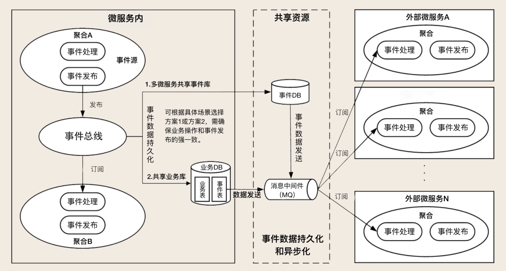
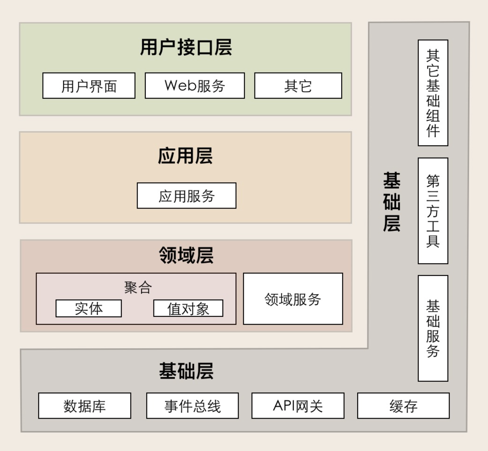

## 领域事件
### 什么是领域事件
在事件风暴过程中，会识别出命令、业务操作、实体等，此外还有事件。比如当业务人员的描述中出现类似“当完成...后，则...”，“当发生...时，则...”等模式时，往往可将其用领域事件来实现。
领域事件表示在领域中发生的事件，它会导致进一步的业务操作。如电商中，支付完成后触发的事件，会导致生成订单、扣减库存等操作。

### 为什么需要领域事件
领域事件的最终目的是为了实现聚合之间的解耦。事件模式是一种通用的解耦方法，相比依赖间的直接调用，通过事件方式形成的间接依赖，在扩展、重构时更加灵活。
在上一篇*领域驱动设计(1) DDD的一些基础概念*中提到设计聚合的原则之一：
>在边界之外使用最终一致性。聚合内数据强一致性，聚合之间数据最终一致性。在一次事务中，最多只能更改一个聚合的状态。如何一个业务操作涉及多个聚合状态的更改，可以采用领域事件的方式，实现聚合之间的解耦；

聚合根管理多个实体，可以在单个进程内实现数据的强一致性；将DDD实现为微服务时，聚合间的交互可能需要采用进程间的通信的方式（HTTP，RPC，MQ），此时如果仍然采用强一致性代价太高，且可靠性差，而最终一致性就成了更好的选择。（领域）事件就是实现最终一致性的一种方式。

领域事件可以切断领域模型之间的强依赖关系，发布方发布事件后不需要关注订阅方处理事件是否成功，这样实现领域模型的解耦，保证领域模型间的独立性，同时也能实现数据的最终一致性。

### 微服务场景下的领域事件
领域事件发生在聚合之间，聚合也是微服务拆分的最小单元。但实践中并不一定每个聚合都拆分为独立的微服务，可能多个关联性高的聚合会被置于同一个微服务中，所以用于聚合间交互的领域事件，在微服务场景下可以细分为微服务内和微服务间的领域事件。
#### 微服务内的领域事件
微服务内的领域事件不是必须的，因为微服务内的操作都发生在同一个进程，可以较方便地控制事务。
假设微服务包含多个聚合，不管是聚合内，还是这些聚合间的交互实际上都发生在进程内，可以做到强一致性。但这不符合DDD`在一次事务中，最多只能更改一个聚合的状态`的原则，此外聚合间采用同步调用的方式也会带来强耦合。
所以可以考虑采用事件总线的实现方式，但事件驱动本身的复杂度大于同步调用，在微服务内处理聚合间的交互还有另一种选择，那就是在应用层来编排和组合跨聚合的调用。
可以结合具体场景分析各种方式的成本和收益。

#### 微服务间的领域事件
微服务间的领域事件用于在跨聚合甚至跨限界上下文间实现业务协作，其主要目的是实现微服务解耦，用异步的领域事件代替同步调用，可以避免微服务间的弹性依赖。

### 领域事件的实现
领域事件设计事件的生成和发布、事件持久化、事件总线、消息中间件、事件订阅和处理等。

- 事件的生成和发布：构建的事件应包含事件ID、时间戳、事件类型、事件源等基本属性，以便事件可以无歧义地在不同上下文间传播；此外事件还应包含具体的业务数据。
- 事件持久化：分布式系统需要考虑分区容忍性，而事件持久化可以保证在发生分区时系统仍然可用，等分区恢复后，系统可继续处理已经持久化的事件。另一方面，持久化的事件还可以用于系统之间的数据对帐或审计。事件持久化的实现，可以选择保存在当前服务所属的数据库，这可以利用本地事务保证数据的强一致性；也可以选择保存在进程外的事件数据库中，但这需要处理分布式事务。
- 事件总线：用于实现微服务内的事件驱动模式，如mediatR；
- 消息中间件：用于跨微服务的事件传递，常用的有kafaka、rabbitMQ等；
- 事件订阅和处理：订阅事件的一方在处理事件前，视业务场景需要，可以选择先保存事件再处理，或者直接处理。

## DDD的分层架构
实现DDD的架构有很多种，比如整洁架构（洋葱架构）、六边形架构、DDD分层架构等等。对整洁架构（洋葱架构）、六边形架构不做了解，只focus在DDD分层架构。

- 用户接口层：暴露用户界面、web服务之类的接口，这里用户还包括其它依赖的服务、自动化测试、批处理脚本等；
- 应用层：应用层包含应用服务，这一层应当很薄，在应用服务进行聚合间的编排、组合；如果需要调用进程外别的服务，也可以在应用层进行；权限校验、事务控制也可以放在这一层；
- 领域层：这一层包含核心的业务逻辑，且应该尽量保持稳定，不依赖别的层。对基础层的依赖通过依赖倒置的方式解决；
- 基础设施层：提供基础设施如数据库、事件总线、API网关、缓存、文件系统等等；作为领域层接口的能力供应商。

### DDD分层架构如何推动微服务演进
领域模型中对象的层次从下到上依次有值对象、实体、聚合、限界上下文。
其中值对象和实体的功能变化，会影响微服务内部的实现变化；聚合的功能变化、重组则会影响微服务的拆分、合并。
首先，在微服务内部，实体的方法被领域服务组合和封装，而领域服务又被应用服务组合和封装。领域层通常只提供一些原子的方法，这些方法在应用层被组合起来提供完整的功能，比如原先提供了领域服务A、领域服务B、领域服务C，应用层按需组合这些领域服务，但过一段时间后发现领域服务B、领域服务C总是被同时调用，那么就可以将他俩重构为一个领域服务。
然后，在微服务之间，可能会用限界上下文来分割微服务，但实际上聚合才是微服务划分的基本单元，因为聚合是最小的、业务内聚的单元，聚合可以独立完成特定的业务逻辑。所以有的时候会将同一限界上下文的聚合拆分为不同的微服务。假设原先微服务中包含聚合A、聚合B，但实际运行中发现聚合A的访问频次远高于聚合B，导致聚合B的性能收到了影响。此时就可以将聚合A独立为单独的微服务。

PS：徐昊在极客时间《如何落地业务建模》中认为，划分微服务的依据应该是弹性边界。从此处DDD对微服务的处理来看，徐昊老师的观点真的是一针见血。比如这里的聚合A与聚合B拆开的例子，明显两者处于不同的弹性边界。

**参考资料: 欧创新 《DDD实战课》**